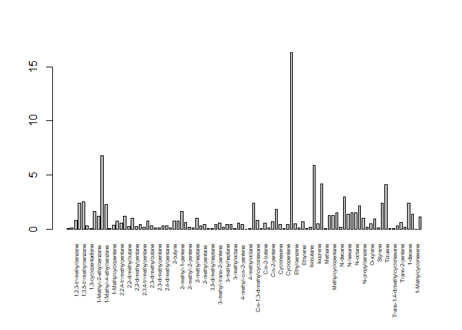
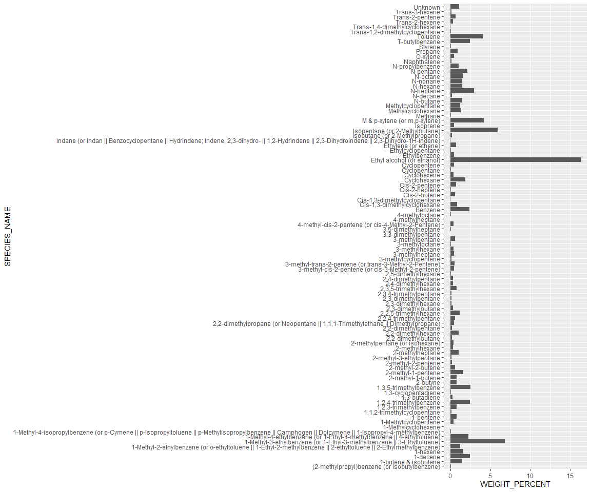

# respeciate 

[](https://github.com/atmoschem/respeciate/actions)

respeciate gives you access to air pollutant emissions profiles in the
[US/EPA Speciate
v5.2](https://www.epa.gov/air-emissions-modeling/speciate) and [EU/JRC
SPECIEUROPE v2.0](https://source-apportionment.jrc.ec.europa.eu/)
archives via R.

The installation is:

``` r
remotes::install_github("atmoschem/respeciate")
```

## example

Find profiles based on search criteria

``` r
library(respeciate)
x <- rsp_find_profile("Ethanol")
x
#> respeciate profile list: 160
#> [NO SPECIES]
#>   (CODE US:0291) Surface Coating Solvent - Methyl Alcohol
#>   (CODE US:1070) Alcohols Production - Methanol - Purge Gas Vent
#>   (CODE US:1071) Alcohols Production - Methanol - Distillation Vent
#>   (CODE US:1132) Ethanolamines
#>   (CODE US:1149) Methanol
#>   (CODE US:1301) 10% Ethanol Composite (Hot Soak + Diurnal) Evaporative
#>     > showing 6 of 160
```

## speciate

``` r
p <- rsp_profile("8833")
```

## plot

Plotting a profile

``` r
#profiles have a default plot option
plot(p)
```



… using lattice barchart syntax

``` r
p2 <- rsp_profile(c(8833, 8850))
plot(p2, key=list(space="top"))
```


