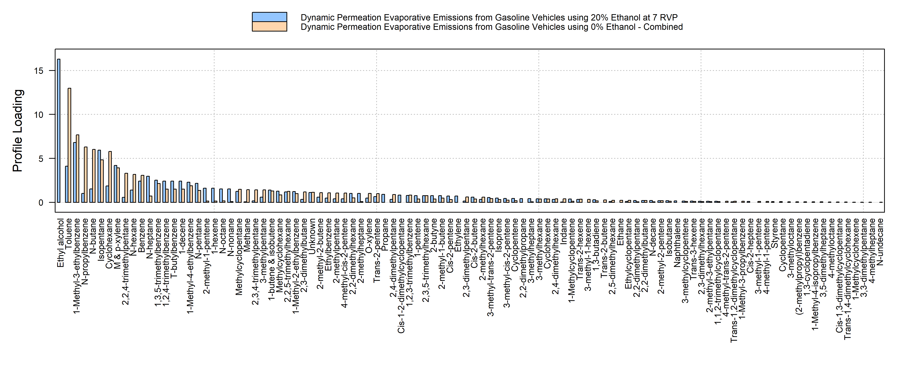

# respeciate 

[](https://github.com/atmoschem/respeciate/actions)

respeciate gives you access to the [US/EPA Speciate
v5.2](https://www.epa.gov/air-emissions-modeling/speciate) profiles in R

The installation is:

``` r
remotes::install_github("atmoschem/respeciate")
```

## example

Find profiles based on search criteria

``` r
library(respeciate)
x <- sp_find_profile("Ethanol")
x
#> respeciate profile reference
#> 0291 1070 1071 1132 1149 1301 1302 1303 1304 1314 5473 5474 5475 5477 5478 5479 
#> 5481 5482 5483 5485 5486 5487 5489 5490 5491 5493 5494 5495 5496 5497 5498 5499 
#> 5500 5501 5502 5503 5504 5505 5506 5507 5508 5509 5510 5511 5512 5513 5514 5515 
#> 5516 5517 5518 5519 5520 5521 5522 5523 5524 5525 5526 5527 5528 5529 5530 5531 
#> 5532 5533 5534 5535 5536 5537 5538 5539 5540 5541 5542 5543 5544 5545 5546 5547 
#> 8200 8210 8215 8733 8736 8751 8751a 8752 8754 8755 8757 8758 8760 8761 8763 
#> 8764 8765 8766 8767 8768 ...
#>    > 160 profiles [showing first 100]
```

## speciate

``` r
p <- sp_profile("8833")
```

## plot

Plotting a profile

``` r
#profiles have a default plot option
plot(p)
```


… or multiple profiles using barplot syntax

``` r
#using base barplot 
p2 <- sp_profile(c(8833, 8850))
plot(p2, beside=TRUE)
```


